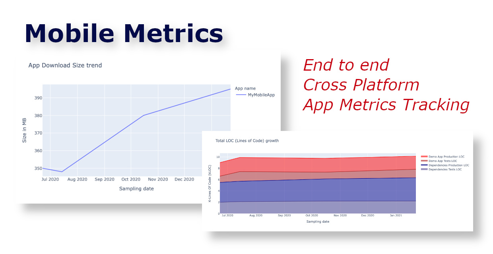

# Mobile Metrics

This project aims at creating a end-to-end set of tools to persist and monitor metrics data related to mobile applications. 

It consists of three main parts:

- **[API](https://github.com/matsoftware/mobile-metrics-api)**: REST API to expose a service that will persist the metrics data to a database
- **[Dashboard](https://github.com/matsoftware/mobile-metrics-dashboard)**: Web frontend to visualize the reports over time
- **[Scripts](https://github.com/matsoftware/mobile-metrics-scripts)**: Set of Python scripts to analyze mobile app metrics and to store data

This framework is in constant evolution and it's intended to provide a flexible set of tools that are not tied to a specific platform and can be easily deployed locally and in any kind of environment (including the most restricting corporate ones).

You can find a demo example at **[mobile-metrics-demo.herokuapp.com](https://mobile-metrics-demo.herokuapp.com)** .

## How to start

Once you clone the three submodules and follow the instructions in the README files, you should be able in few minutes to have a dashboard running locally.

The APIs come with a set of predefined data that will help you start your measurements with your local data. Currently only the IPA size script is provided, but more tools will be deployed in the future.

## Contact

[Mattia Campolese](https://www.linkedin.com/in/matcamp/)